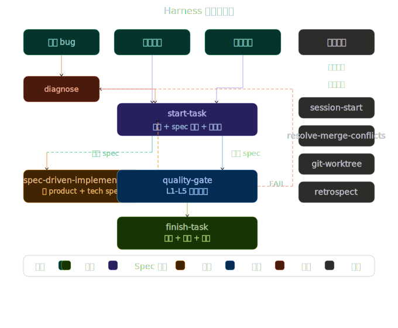
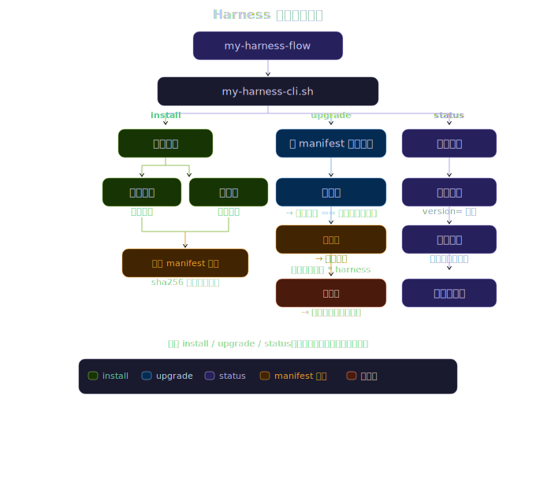

# my-harness-flow

一套完整的 AI 开发工作流框架：**中文技能库 + 编排层 + 多 agent 工具注册 + 项目模板**，一行命令装进任意仓库，让 AI agent 按稳定、可复现的流程做开发。

## 1. 设计思想

- **路由优先**：agent 收到请求先查 `AGENTS.md` 路由表选流程，不自由发挥；不匹配就问用户
- **定档驱动验证**：任务按规模/风险定档（Light/Standard/Full），档位决定验证深度（L1-L5），避免小改动跑全量、大改动漏验证
- **失败先归因再动手**：任何验证失败先走 `diagnose` 的 test→env→artifact→code 归因链，多数失败不是代码问题，禁止上来就改代码
- **过程留痕**：exec-plan（跨会话恢复）+ work-journal（交付记录）+ bugs 档案（根因沉淀），复盘有据可查
- **技能即文档**：全部能力以 agentskills.io 规范的 SKILL.md 承载，版本可控、人可审查、跨工具复用
- **架构可视化**：任务工作流与框架生命周期各有完整设计图（见下方对应章节）
- **多平台自适应**：从 git remote URL 自动判定 GitHub/GitLab，技能自动选择对应 CLI（gh/glab）；纯本地项目优雅降级，不阻断流程
- **模板驱动**：内置 exec-plan / design-doc / bug-report / pitfall 等文档模板骨架，agent 产出格式统一、可审查

## 2. 能力清单

| 模块              | 内容                                                                                                                                                                                                                                                                              |
| ----------------- | --------------------------------------------------------------------------------------------------------------------------------------------------------------------------------------------------------------------------------------------------------------------------------- |
| 基础技能（15 个） | git-commit / git-branch / git-push / git-worktree / resolve-merge-conflicts / create-issue / create-pr / review-pr-local / review-spec-local / pr-walkthrough / write-tech-spec / write-product-spec / spec-driven-implementation / diagnose-ci-failures / bootstrap-issue-config |
| 编排技能（6 个）  | start-task（定档+分支+计划）/ quality-gate（分层验证）/ finish-task（提交+归档+留痕）/ session-start（上下文恢复）/ diagnose（失败归因）/ retrospect（证据复盘）                                                                                                                  |
| 多 agent 注册     | WorkBuddy（用户级+项目级）/ Claude Code / Gemini CLI 软链注册，Codex CLI 原生扫描，Cursor 指引接入（.cursor/rules/agents.mdc）           |
| 项目模板          | AGENTS.md 路由表模板 + docs 骨架 + L1-L5 分层测试骨架                                                                                                                                                                                                                             |
| CI 自动化         | 17 个 CI 技能 + 12 个受管 workflow + 支撑脚本（issue triage / spec 生成 / issue 实现 / PR review）                                                                                                                                                                                |

## 3. 核心工作流

```
新需求/发现 bug
    │
    ▼
session-start（跨会话恢复上下文）
    │
    ▼
start-task ──── §1 定档 ────> Light / Standard / Full
    │         §2 读 specs/README.md
    │         §3 spec 驱动决策
    │             ├── [是] → §3.1 建 spec 目录 + 调用 write-product-spec/
    │             │          write-tech-spec 填充内容 🔒 自动模式激活
    │             └── [否] → 按 README 要求补 Light 级 spec（如有）
    │         §4 建分支 + §5 写 exec-plan（有 spec 则精简引用）
    │
    ├── §8.1 实现阶段（先读 spec → 按验收标准编码）
    │
    ├── §8.2 验证阶段 ──> quality-gate（按档 L1→L2→L3→L5）
    │         │              任一层 FAIL → diagnose 归因
    │         │              修复后从失败层重跑，3 次上限上报用户
    │         └── PASS ──> §8.3 收尾阶段 ──> finish-task
    │                                              精确提交 + 推送 + PR
    │                                              归档 exec-plan + 写工作日志
    └── 异常 ──> diagnose（test→env→artifact→code 归因链）
```

辅助：`retrospect`（基于工作日志的证据复盘）。全程通过 `session-start` 断点续传。



## 4. 典型用法

### 4.1 全新项目接入

```bash
# 通用安装（21 个核心技能 + 测试骨架）
./my-harness-cli.sh install --target ./my-project

# 带领域 Profile（追加专属技能 + 路由规则）
./my-harness-cli.sh install --target ./my-project --profile backend   # 服务端
./my-harness-cli.sh install --target ./my-project --profile web       # 前端
./my-harness-cli.sh install --target ./my-project --profile mobile    # 移动端
```

### 4.2 老项目接入（含冲突处理）

```bash
# 交互模式：逐一确认冲突文件（推荐）
./my-harness-cli.sh install --target ./existing-project

# 自动化模式：静默保留已有文件
./my-harness-cli.sh install --target ./existing-project --yes
```

### 4.3 生命周期管理

```bash
# 查看安装状态
./my-harness-cli.sh status --target ./my-project

# 无损升级
./my-harness-cli.sh upgrade --target ./my-project

# 卸载
./my-harness-cli.sh uninstall --target ./my-project

# 仅注册技能（补软链）
./my-harness-cli.sh register --target ./my-project
```

### 4.4 自动化 / CI 场景

```bash
# CI 管道非交互安装
./my-harness-cli.sh install --target ./repo --yes --profile backend

# 环境变量注入（兼容旧脚本）
HARNESS_FLOW_ANSWER=k ./my-harness-cli.sh install --target ./repo
# k = 保留 AGENTS.md / o = 覆盖 / h = 另存

# 预览（dry-run）
./my-harness-cli.sh install --target ./repo --profile web --dry-run
```

## 5. 安装到目标项目

```bash
# 子命令方式（推荐）
./my-harness-cli.sh install --target /path/to/your-repo    # 安装
./my-harness-cli.sh upgrade --target /path/to/your-repo    # 无损升级
./my-harness-cli.sh status  --target /path/to/your-repo    # 查看安装状态
./my-harness-cli.sh install --target /path/to/your-repo --dry-run  # 安装预览
# 兼容旧 flags
./my-harness-cli.sh --target /path/to/your-repo            # 自动判定（安装/升级）
```

| 命令 | 作用 |
|------|------|
| `install` | 安装到目标仓库（全新安装或老项目接入） |
| `upgrade` / `update` | 升级已安装的 harness（要求已装，三态无损） |
| `uninstall` | 从目标仓库移除 harness（基于 manifest 清受管文件与软链） |
| `register` | 仅注册技能软链（幂等，可反复执行） |
| `status` | 显示安装状态：版本 / manifest / 差异摘要 / 下一步指引 |
| `version` | 显示框架版本号 |
| `help` | 完整选项说明 |

| 选项 | 适用命令 | 作用 |
|------|---------|------|
| `--target <path>` | 所有 | 目标仓库路径，默认当前目录 |
| `--dry-run` | 所有 | 只打印计划与冲突清单，不写文件 |
| `--no-templates` | install | 跳过模板实例化，只同步技能与 CI 资产 |
| `--force` | install（旧安装） | 冲突不提问，直接覆盖（CI 场景；manifest 存在时无效） |
| `--skip-existing` | install（旧安装） | 冲突不提问，保留已有只新增 |

安装器做四件事：

1. **受管目录同步**（rsync，可重复执行）：`.agents/skills`、`.agents/contracts`、`.github/{skills,agents,scripts,workflows}`
2. **模板实例化**（只补缺，绝不覆盖已有文件）：`AGENTS.md`、`CLAUDE.md`、`docs/{bugs,design-docs,exec-plans,generated,plan,product-specs,references,reports,work-journal}`、`specs/`（含产品/技术 spec 模板）、`.agents/quality-gate/{l1..l5}`、`.cursor/rules/agents.mdc`（Cursor 指引）
3. **`.gitignore` 保护**：自动追加 agent 本地状态目录忽略规则（`.workbuddy/` `.claude/` `.gemini/` `__pycache__/`），防止开发环境文件被提交（幂等，已有标记区段时跳过）
4. **多 agent 技能注册**（软链，幂等）：
   - WorkBuddy → `~/.workbuddy/skills/`（**用户级**）和 `.workbuddy/skills/`（项目级）
   - Claude Code → `.claude/skills/`、Gemini CLI → `.gemini/skills/`（项目级，agentskills.io 规范）
   - Codex CLI → 原生扫描 `.agents/skills/`，无需注册
   - Cursor → `.cursor/rules/agents.mdc`（指引接入，指向 AGENTS.md）

安装后必做：

1. 编辑 `AGENTS.md`，替换 `{{PROJECT_NAME}}` 等占位符，填写模块清单与硬规则
2. 按项目技术栈实现 `.agents/quality-gate/` 下各层脚本（保持脚本名与退出码约定：0 = PASS）
3. 重开 agent 工具会话，让新技能进入可用列表

> **自动化安装（CI / 脚本）**：在非交互环境中，可用 `HARNESS_FLOW_ANSWER` 环境变量注入交互回答：
> ```bash
> HARNESS_FLOW_ANSWER=k ./my-harness-cli.sh install --target /path/to/repo
> # k = 保留已有 AGENTS.md
> # o = 用框架模板覆盖
> # h = 框架模板另存为 AGENTS.md.harness
> ```
> 另见下方冲突处理的 `--force` / `--skip-existing` 选项。

### 5.1 冲突处理与重复执行

安装器自动识别三种目标状态：

| 目标状态                              | 行为                                                                                                                                  |
| ------------------------------------- | ------------------------------------------------------------------------------------------------------------------------------------- |
| 全新空工程                            | 静默完整安装，零提问                                                                                                                  |
| 老项目（已有 AGENTS.md / 定制过技能） | 冲突文件逐一确认：受管文件`[o]覆盖 / [s]保留只新增 / [a]中止`；AGENTS.md 可选 `保留 / 覆盖 / 另存为 AGENTS.md.harness` 供手动合并 |
| 已初始化过、重复执行                  | 零副作用：无差异时短路只校验注册；有差异时走无损升级（见下）                                                                          |

- 非交互环境（CI / 管道）未指定策略时**安全中止**，用 `--force`（覆盖）或 `--skip-existing`（保留）显式指定
- 首次安装会在目标写入 `.agents/.harness-flow-installed` 标记文件（含框架版本号）与 `.agents/.harness-flow-manifest`（受管文件 sha256 基线清单）

### 5.2 无损升级

框架更新后，在目标仓库重跑安装器即完成升级。存在 manifest 基线时逐文件三态判定，**定制永不丢失、全程无需人工介入**：

| 判定   | 条件                 | 行为                                             |
| ------ | -------------------- | ------------------------------------------------ |
| 未定制 | 本地哈希 == 安装基线 | 自动更新为框架新版                               |
| 已定制 | 本地哈希 != 安装基线 | 本地保留，框架新版另存为`*.harness` 供手动合并 |
| 已废弃 | 基线有、新框架已删   | 仅报告，不自动删除                               |

- `--force` / `--skip-existing` 在升级模式下不生效（定制文件永不被覆盖）
- 旧版安装（无 manifest）自动回退为上表的冲突确认流程；重跑一次成功安装后即生成 manifest，此后享受无损升级
- 框架版本记录在 `VERSION` 文件（变更历史见 `CHANGELOG.md`），已装版本可查目标仓库 `.agents/.harness-flow-installed` 的 `version=` 字段

### 5.3 领域 Profile

通过 `--profile` 选项安装领域专属技能与测试骨架，适配不同开发场景：

```bash
./my-harness-cli.sh install --target /path/to/repo --profile backend   # 服务端
./my-harness-cli.sh install --target /path/to/repo --profile web       # Web 前端
./my-harness-cli.sh install --target /path/to/repo --profile mobile    # 移动端
```

| Profile | 追加技能 | 典型测试 |
|---------|---------|---------|
| `backend` | api-contract-test / db-migration-verify / integration-test | MySQL/Redis 可达性 + API 契约 + DB 迁移验证 |
| `web` | component-test / e2e-test / build-verify | npm audit + lint + 构建 + E2E 浏览器 |
| `mobile` | simulator-manage / ui-automation-test / build-sign | Xcode/Gradle 环境 + 模拟器 + 签名验证 |

Profile 会追加路由规则到 `AGENTS.md`，并将专属技能注册到各 agent。不选 `--profile` 时安装通用核心，行为不变。



## 6. 目录结构

```
my-harness-flow/
├── my-harness-cli.sh       # 生命周期管理器（安装 / 无损升级 / 注册 / 校验）
├── VERSION                 # 框架版本号（不分发，仅写入目标 marker）
├── CHANGELOG.md            # 框架变更历史（不分发）
├── .agents/
│   ├── skills/             # 21 个技能（15 基础 + 6 编排）
│   └── contracts/          # review 契约（schema + 文档）
├── .github/
│   ├── skills/             # CI 技能（含 *-repo companion，仅本仓库自用不分发）
│   ├── workflows/          # 受管 workflow（ci.yml 为框架自用不分发）
│   ├── scripts/            # workflow 支撑脚本
│   ├── agents/             # CI agent 配置
│   └── harness-tests/      # CI 脚本 unittest 套件（501 用例，框架自检不分发）
├── docs/                   # 框架自身的工作目录（与目标项目结构一致）
│   ├── bugs/ design-docs/ generated/ product-specs/
│   ├── references/ reports/ exec-plans/ plan/ work-journal/
│   └── specs/
└── templates/
    ├── AGENTS.md.template  # 项目路由表模板（占位符化）
    ├── docs/               # bugs / design-docs / exec-plans 等全量骨架
    ├── specs/              # spec 目录约定 + 产品/技术 spec 模板
    └── .agents/quality-gate/    # L1-L5 分层测试骨架
```

## 7. CI 自动化（可选启用）

`.github/` 下的 issue triage、spec 生成、issue 实现、PR review 自动化依赖 GitHub Actions + OpenAI API，需在目标仓库配置 `OPENAI_API_KEY`（Actions secret）、`OPENAI_API_ENDPOINT` / `AGENT_LOGIN`（Actions variables）等。不用 GitHub 协作流时这些文件静置无副作用。

## 8. 致谢

本项目受 [Terry-Mao/AICodingFlow](https://github.com/Terry-Mao/AICodingFlow) 启发，在其基础上改造、扩展并自演进而来。

## 9. 协议

[MIT](LICENSE)
